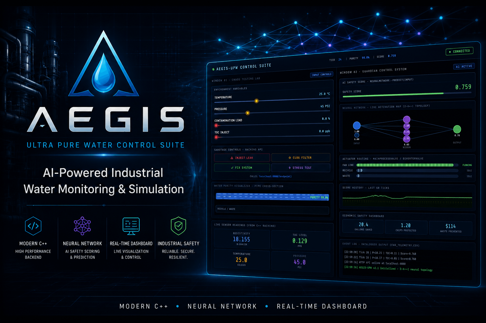
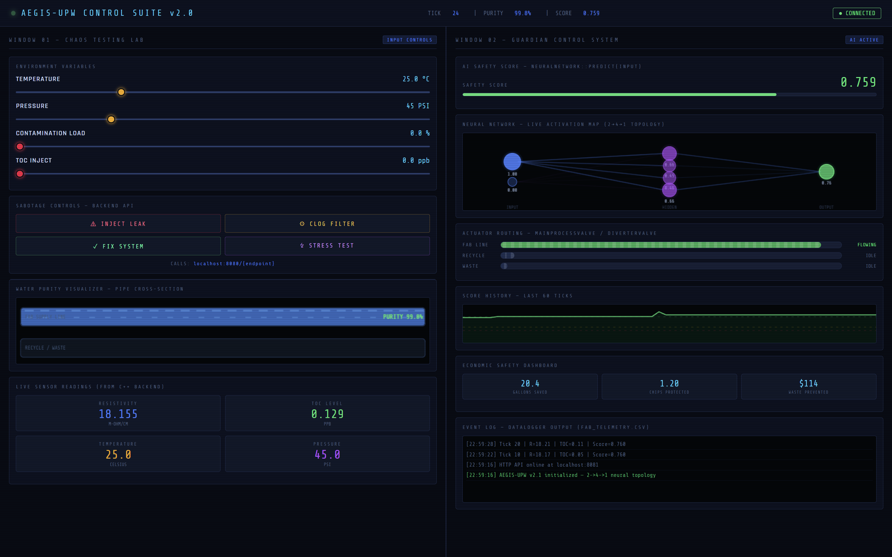
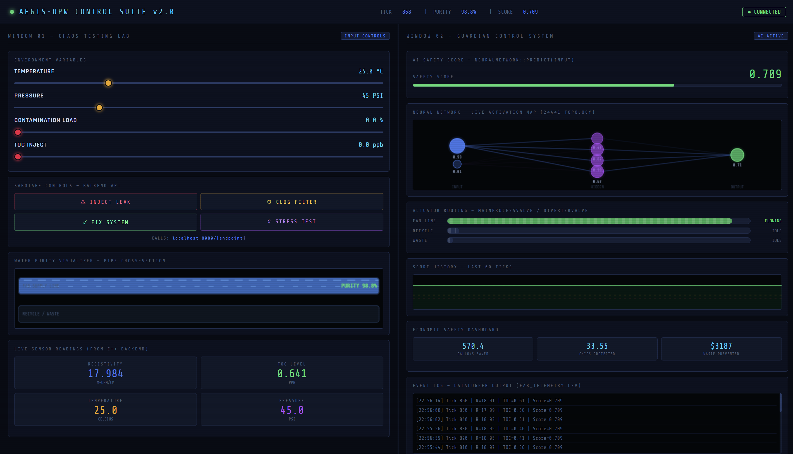
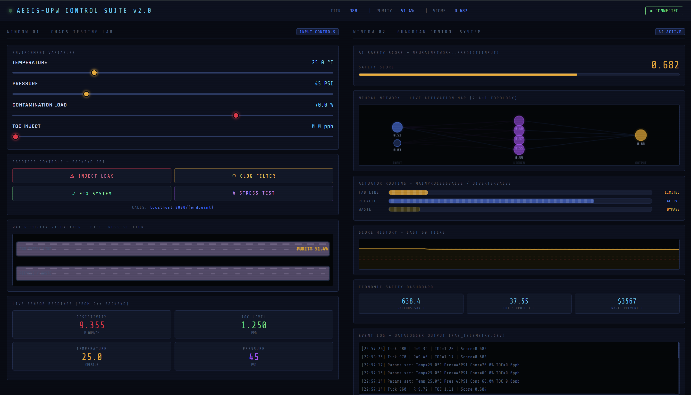
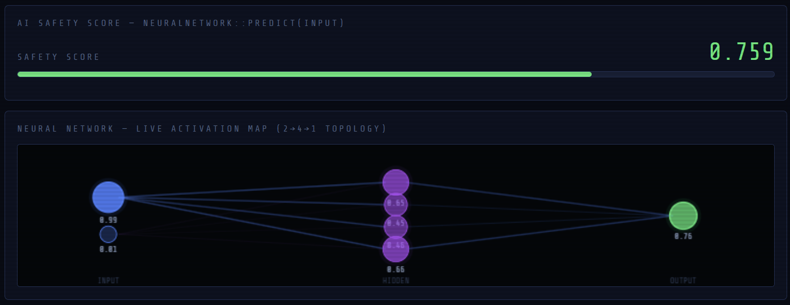
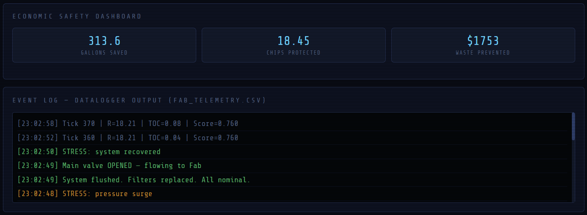

<p align="center">
  
</p>

<h1 align="center">AEGIS</h1>

<p align="center">
  <strong>Ultra Pure Water Control Suite</strong>
</p>

<p align="center">
AI-Powered Industrial Water Monitoring & Simulation
</p>

<p align="center">


</p>

---

## Overview

AEGIS is an AI-powered Ultra Pure Water (UPW) monitoring and control simulation inspired by modern industrial SCADA systems.

The project combines a high-performance C++ backend with a responsive web dashboard to simulate real-time environmental monitoring, neural-network-based safety prediction, actuator control, and operational analytics.

Designed as both a learning project and an engineering simulation, AEGIS demonstrates how industrial automation concepts can be visualized through an interactive digital twin.

## ✨ Features

- 🧠 **AI Safety Prediction**
  - Uses a feed-forward neural network to analyse water purity and generate a real-time safety score.

- ⚙️ **Modern C++ Backend**
  - High-performance simulation engine handling environmental variables, actuators, sensors, and system state.

- 📊 **Real-Time Dashboard**
  - Interactive web interface with live telemetry, gauges, graphs, and system controls.

- 🌊 **Ultra Pure Water Simulation**
  - Models resistivity, TOC levels, contamination events, leaks, and clogging scenarios.

- 🔄 **Industrial Actuator Control**
  - Simulates valve routing, waste diversion, and purification flow based on system conditions.

- 📈 **Operational Analytics**
  - Tracks safety score history, production metrics, water savings, and chip protection statistics.

- 📝 **Event Logging**
  - Built-in logging system that records simulation events and backend activity in real time.

- 🎛️ **Interactive Controls**
  - Adjust environmental parameters, inject contamination, simulate failures, and observe immediate system responses.

  ## 🚀 Project Highlights

- Real-time communication between a C++ backend and a browser-based dashboard.
- Interactive digital twin inspired by industrial SCADA systems.
- AI-driven safety scoring using a custom neural network.
- Modular C++ architecture with dedicated simulation components.
- Modern cyber-industrial interface designed for clarity and usability.
- Designed as an educational simulation of Ultra Pure Water (UPW) monitoring.

## 📸 Screenshots

### Dashboard Overview

The primary control interface displaying live environmental variables, AI safety scoring, actuator status, operational analytics, and event logging.

<p align="center">
  
</p>

---

### Normal Operation

The system operating under healthy conditions with stable purity, high resistivity, and uninterrupted production flow.

<p align="center">
  
</p>

---

### Contamination Event

Simulation of a contamination scenario demonstrating automatic safety score degradation, flow diversion, and system response.

<p align="center">
  
</p>

---

### Neural Network Visualization

Live visualization of the feed-forward neural network used to generate the AI safety score.

<p align="center">
  
</p>

---

### Event Logging

Real-time telemetry and backend logging for monitoring system behaviour and diagnostics.

<p align="center">
  
</p>

## 🏗️ System Architecture

AEGIS follows a modular client-server architecture.

The simulation engine is implemented in Modern C++ and exposes a lightweight HTTP API that streams the current system state to a browser-based dashboard. Environmental variables, sensors, actuators, neural-network inference, and event logging operate independently before being consolidated into a unified simulation state that is rendered in real time.

<p align="center">
  
</p>

## ⚙️ How It Works

AEGIS simulates the operation of an industrial Ultra Pure Water (UPW) treatment system through a continuous real-time simulation loop.

Each simulation cycle performs the following operations:

1. **Read Environmental Inputs**
   - Temperature, pressure, contamination level, and Total Organic Carbon (TOC) are updated from the simulation controls.

2. **Simulate Water Quality**
   - The simulation calculates purity, resistivity, and other process variables based on the current operating conditions.

3. **AI Safety Evaluation**
   - A feed-forward neural network analyses the simulated water quality and generates an overall safety score.

4. **Decision Making**
   - The backend determines whether purification should continue, divert water to waste, or trigger protective actions.

5. **Update Actuators**
   - Valves and routing mechanisms respond automatically to the evaluated system state.

6. **Generate System State**
   - The complete simulation state is serialized into JSON.

7. **Refresh Dashboard**
   - The browser fetches the latest data through the HTTP API, updating gauges, charts, indicators, and event logs in real time.

   ## 🔄 Simulation Pipeline

```text
User Controls
      │
      ▼
Environmental Parameters
      │
      ▼
Simulation Engine
      │
      ▼
Water Quality Model
      │
      ▼
Neural Network Inference
      │
      ▼
Safety Score
      │
      ▼
Actuator Decisions
      │
      ▼
JSON State Generation
      │
      ▼
HTTP API
      │
      ▼
Real-Time Dashboard
```

## 🛠️ Technology Stack

| Category | Technologies |
|----------|--------------|
| Language | Modern C++17 |
| Frontend | HTML5, CSS3, JavaScript |
| Backend | Custom HTTP Server |
| AI | Feed-Forward Neural Network |
| Networking | REST-style JSON API |
| Build System | GNU Make |
| Platform | Windows (WSL), Linux |

## 📂 Project Structure

```text
AEGIS-UPW-Control-Suite
│
├── assets/
│   ├── branding/
│   ├── diagrams/
│   ├── screenshots/
│   └── demo/
│
├── docs/
│
├── server.cpp
├── Environment.cpp
├── Layer.cpp
├── DataLogger.cpp
├── Actuator.cpp
├── Makefile
├── aegis_dashboard.html
└── README.md
```

## 🚀 Getting Started

### Prerequisites

Before running AEGIS, ensure you have the following installed:

- **C++17 compatible compiler** (GCC/G++)
- **GNU Make**
- **Python 3** (for serving the dashboard)
- A modern web browser (Chrome, Edge, or Firefox)

---

## 📦 Installation

### 1. Clone the repository

```bash
git clone https://github.com/AryaanTaimur-18/aegis-upw-control-suite.git
cd aegis-upw-control-suite
```

### 2. Build the backend

```bash
make aegis_server
```

If `make` is unavailable, compile manually:

```bash
g++ -std=c++17 server.cpp Environment.cpp Layer.cpp DataLogger.cpp Actuator.cpp -o aegis_server -lpthread
```

### 3. Start the simulation server

```bash
./aegis_server
```

Expected output:

```text
[AEGIS-SERVER] Listening on http://localhost:8080
```

### 4. Serve the dashboard

Open another terminal and run:

```bash
python3 -m http.server 5500
```

### 5. Open the dashboard

Visit:

```text
http://localhost:5500/aegis_dashboard.html
```

If everything is working correctly, the dashboard will display a green **CONNECTED** status and begin updating in real time.

## 💻 Usage

Once the dashboard is running, you can interact with the simulation in real time.

### Monitor

- Water resistivity
- TOC levels
- AI safety score
- Production metrics
- Event logs

### Simulate

- Contamination events
- Temperature changes
- Pressure variations
- Sensor behaviour

### Observe

- Automatic actuator responses
- Valve switching
- Waste diversion
- Safety score updates
- Neural network visualisation

## 🗺️ Roadmap

- [x] Modern C++ simulation engine
- [x] Interactive web dashboard
- [x] Neural-network safety prediction
- [x] Event logging
- [x] Real-time HTTP API
- [ ] Historical data visualisation
- [ ] Authentication & user roles
- [ ] Docker deployment
- [ ] Configurable simulation profiles
- [ ] REST API documentation
- [ ] Unit tests
- [ ] CI/CD pipeline

## 🔮 Future Improvements

Future versions of AEGIS may include:

- Advanced machine learning models for predictive maintenance
- Historical trend analysis and reporting
- Multi-user dashboard access
- Docker-based deployment
- Database integration for persistent telemetry
- Mobile-responsive monitoring interface
- Automated testing and continuous integration

## 📄 License

This project is licensed under the MIT License.

See the `LICENSE` file for details.

## 👨‍💻 Author

**Aryaan Taimur Saeed**

Data Science Undergraduate  
FAST – National University of Computer and Emerging Sciences (FAST-NUCES), Karachi Campus

- GitHub: https://github.com/AryaanTaimur-18
- LinkedIn: https://www.linkedin.com/in/aryaan-taimur-saeed-b380b73a0/